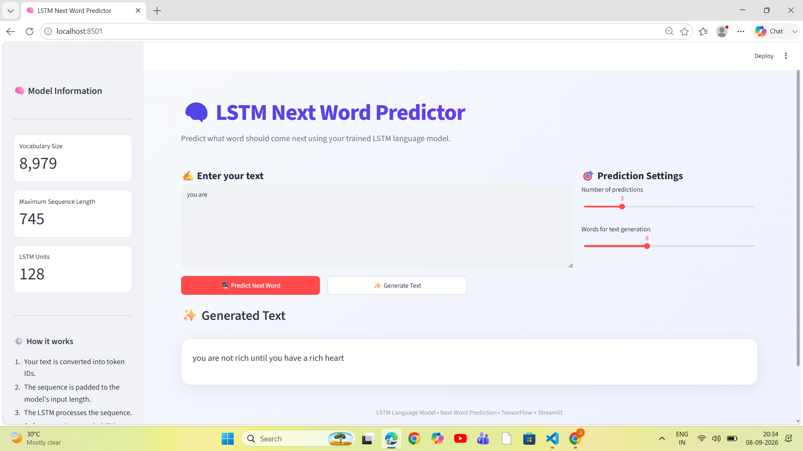

# 🧠 LSTM Next Word Predictor

An interactive **Next Word Prediction and Text Generation application** built using **Long Short-Term Memory (LSTM)** neural networks, **TensorFlow**, and **Streamlit**.

The application predicts the most likely next word based on the text entered by the user. It can also generate multiple words sequentially to create a continuation of the given text.

---

## 📸 Application Screenshot




---

## 🚀 Features

- 🔮 **Next Word Prediction**
  - Predicts the most probable next word for a given input sentence.

- 📊 **Top-K Predictions**
  - Displays multiple possible next words with their prediction probabilities.

- ✨ **Text Generation**
  - Generates multiple words sequentially from a starting sentence.

- 🎯 **Prediction Settings**
  - Adjust the number of predictions displayed.
  - Control the number of words generated.

- 📈 **Model Information**
  - Displays vocabulary size.
  - Displays maximum sequence length.
  - Displays the number of LSTM units.

- 🖥️ **Interactive User Interface**
  - Clean and modern UI built using Streamlit.
  - Responsive layout with sidebar information and prediction controls.

- 
## 🛠️ Technologies Used

| Technology | Purpose |
|---|---|
| 🐍 Python | Core programming language |
| 🧠 TensorFlow / Keras | Building and running the LSTM model |
| 🌐 Streamlit | Interactive web application |
| 🔢 NumPy | Numerical computations |
| 🥒 Pickle | Loading tokenizer and sequence length |

---

## 🧠 How It Works

The application follows the following workflow:

```text
User Input
    ↓
Text Tokenization
    ↓
Convert Words to Token IDs
    ↓
Sequence Padding
    ↓
LSTM Model
    ↓
Probability Distribution
    ↓
Predicted Next Word